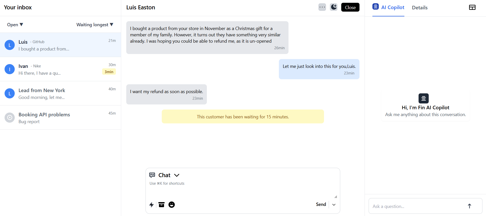

# BeyondChats

A modern, responsive chat application built with React and Vite that enhances the Admin chat experience with AI-powered features.
---

## 🔗 Live Demo
[👉 Click here to visit the deployed app](https://your-deployed-link.com)

## 🎥 Demo Video  
[![Watch Demo Video]](https://drive.google.com/file/d/1gcV2lC5P3836UWsFmxCMI3RfYqowehHY/view?usp=drivesdk )

## 📸 App Preview  


---

## Features

### Responsive Design
- Fully responsive layout that works seamlessly across all devices
- Mobile-first approach with adaptive design
- Smooth transitions and animations
- Optimized for both desktop and mobile viewing
  
  

### AI Integration
- Built-in Fin Copilot with gemini integration
- Animation through Framer motion
- Smart popup system for AI assistance
- Seamless integration of AI responses into the chat composer


### Chat Interface
- Clean and intuitive chat composer
- Real-time message updates
- Quick access to AI assistance
- Message history preservation


## Getting Started

### Prerequisites
- Node.js (v14 or higher)
- npm or yarn

### Installation
1. Clone the repository
```bash
git clone [repository-url]
```

2. Install dependencies
```bash
npm install
# or
yarn install
```

3. Start the development server
```bash
npm run dev
# or
yarn dev
```

## Development

### Tech Stack
- React
- Vite
- Tailwind CSS (with responsive design)
- AI Integration APIs

### Project Structure
```
src/
├── components/    
├── App.jsx      
├── Index.css         
├── Main.jsx     
       

